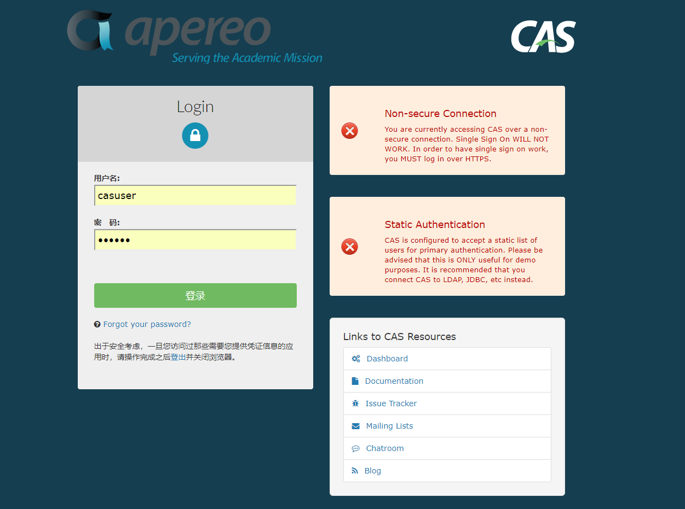

```
基于Powered by Apereo Central Authentication Service 5.2.6 2018-09-22T06:25:50Z
https://apereo.github.io/cas/5.2.x/


yum install -y java-1.8.0-openjdk
yum install -y maven
maven设置国内源

git clone https://github.com/apereo/cas-overlay-template.git
cd cas-overlay-template/
git branch -a
git checkout 5.2
./build.sh help
vim etc/cas/config/cas.properties
cas.server.name: https://sso.dev.xxx.cn:8443/
cas.server.prefix: https://sso.dev.xxx.cn:8443/cas

./build.sh package

                <dependency>
                    <groupId>org.apereo.cas</groupId>
                    <artifactId>cas-server-support-pm-jdbc</artifactId>
                    <version>${cas.version}</version>
                </dependency>


git clone https://github.com/apereo/cas-management-overlay.git
cd cas-management-overlay
git branch -a
git checkout 5.2
scp cdn02:/data0/src/cas/cas-management-overlay/target/cas-management.war .
```
http://10.1.16.153:8080/cas  默认账号:casuser  密码:Mellon


# to-do-list:
- ~~Non-secure Connection, tomcat设置https访问即可~~
- Static Authentication，接入ldap解决账号问题
- cas-services-management-overlay

```
参考资料：https://apereo.github.io/cas/5.3.x/installation/Password-Management-LDAP.html

cd /data0/src/cas/cas-overlay-template
vim pom.xml
<dependency>
    <groupId>org.apereo.cas</groupId>
    <artifactId>cas-server-support-pm-ldap</artifactId>
    <version>${cas.version}</version>
</dependency>
./build.sh package
scp cdn02:/data0/src/cas/cas-overlay-template/target/cas.war .

未认证授权的服务
CAS的服务记录是空的，没有定义服务。希望通过CAS进行认证的应用程序必须在服务记录中明确定义

CAS 5.x 默认情况下不支持HTTP的客户端接入，建议客户端采用HTTPS协议。

不过，确实无法升级为HTTP的，那也可以把CAS Server开启支持HTTP的客户端接入。

具体开发的方法如下：

1. 修改http支持的配置
打开文件：cas\WEB-INF\classes\services\HTTPSandIMAPS-10000001.json
{
  "@class" : "org.apereo.cas.services.RegexRegisteredService",
  "serviceId" : "^(https|imaps)://.*",
  "name" : "HTTPS and IMAPS",
  "id" : 10000001,
  "description" : "This service definition authorizes all application urls that support HTTPS and IMAPS protocols.",
  "evaluationOrder" : 10000
}
第三行改为 (https|http|imaps)
2. 启用记载JSON配置文件
打开文件cas\WEB-INF\classes\application.properties
增加如下配置
cas.tgc.secure=false
cas.serviceRegistry.initFromJson=true
重新启动cas就ok了
```

# CAS与jenkins集成
- https://wiki.jenkins.io/display/JENKINS/CAS+Plugin
- https://www.2cto.com/kf/201804/739613.html
```
- jenkins安装CAS插件
- jenkins配置插件信息
- 测试并验证

问题:
管理用户如何设置？
```
# CAS与Confluence集成
- https://blog.csdn.net/yelllowcong/article/details/79651651
# CAS与Jira集成

# 参考资料
- https://www.cnblogs.com/flying607/p/7598248.html
- https://apereo.github.io/2018/02/06/cas52-gettingstarted-overlay/
- https://blog.csdn.net/xiaoxing598/article/details/55518241
- https://blog.csdn.net/fireofjava/article/details/79072187
- https://blog.csdn.net/zhurhyme/article/category/2362091 较老cas系列文章
- https://blog.csdn.net/u010475041/article/category/7156505 cas系列文章
- https://github.com/X-rapido/CAS_SSO_Record
- https://www.cnblogs.com/jpeanut/tag/CAS/


https://apereo.github.io/cas/5.3.x/installation/Password-Management-JDBC.html
